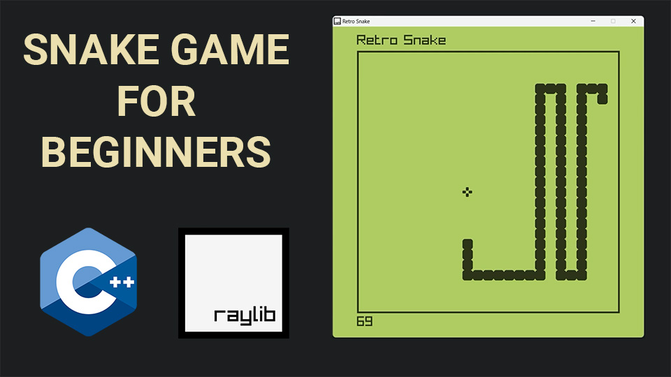

# C++ Snake game using raylib

This GitHub repository contains the full source code for a Snake game created using the raylib game development library. The game is programmed in the C++ programming language and uses various raylib functions for graphics, input handling, and audio. The game is designed to be played on desktop computers running Windows, macOS, or Linux operating systems. The code is well-structured, easy to read, and heavily commented, making it an excellent resource for aspiring game developers who want to learn more about game programming using raylib

If you're interested in learning how to create your own snake game with raylib, then you'll want to check out the <a href="https://youtu.be/LGqsnM_WEK4">Video Tutorial on YouTube</a> that accompanies this Github repository. The tutorial takes you through each line of code, explaining the logic behind it and demonstrating how it affects the game. You'll learn how to set up the game window, create the snake and food classes, add collision detection, and implement sound effects. By the end of the tutorial, you'll have a fully functional snake game that you can play and modify to your heart's content. So, grab a cup of coffee and get ready to dive into the world of game development with raylib!

# Video Tutorial

  

🎥 <a href="https://youtu.be/LGqsnM_WEK4">Video Tutorial on YouTube</a>

 
 

| 📺 <a href="https://www.youtube.com/channel/UC3ivOTE5EgpmF2DHLBmWIWg">My YouTube Channel</a>
| 🌍 <a href="http://www.educ8s.tv">My Website</a> |  

